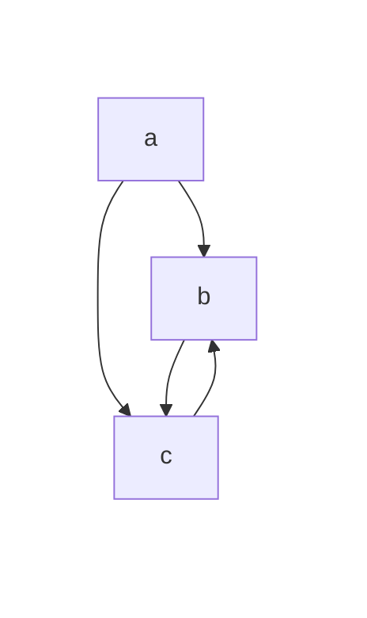

# Tips of using Github

## access gist

Access to [gist](https://gist.github.com/) to create secret or public gist.

## use Mermaid in gist

Mermaid can be directly used in gist with following example

## github pages

[how to depoly page in github page](https://docsify.js.org/#/deploy?id=github-pages)
For free user, the docs can be depolied with public repo.

### github actions can convert docs with pandoc

[pandoc with github-actions](https://pandoc.org/installing.html#github-actions)
