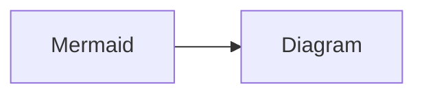

# Markdown

## Examples

### links

- [doc internal link](#reference-of-markdown)
- [project internal link](/explore/charter.md)

### quote

> this is the quote
>
> > this is the second line of quote
> > this is the second line of quote

### Mermaid

### Divider

up

---

down

### Todo list

- [ ] Todo 1
- [ ] Todo 2

## Reference of Markdown

- [markdown-guidance](https://docs.microsoft.com/en-us/azure/devops/project/wiki/markdown-guidance?view=azure-devops)
- [how to add internal link reference](https://stackoverflow.com/questions/2822089/how-to-link-to-part-of-the-same-document-in-markdown)
- [markdown in vscode devcontainer](https://github.com/microsoft/vscode-dev-containers/blob/main/script-library/README.md)
