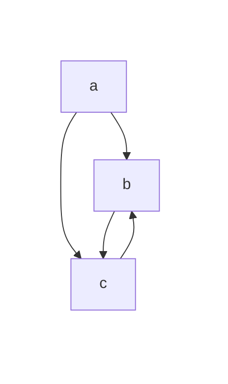
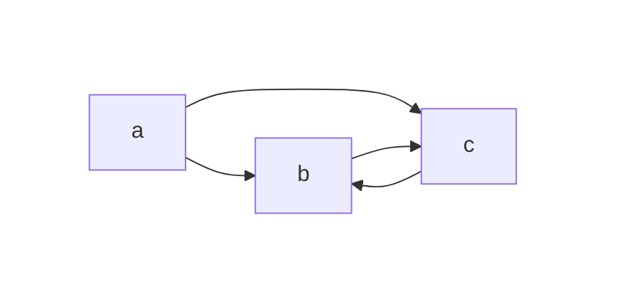
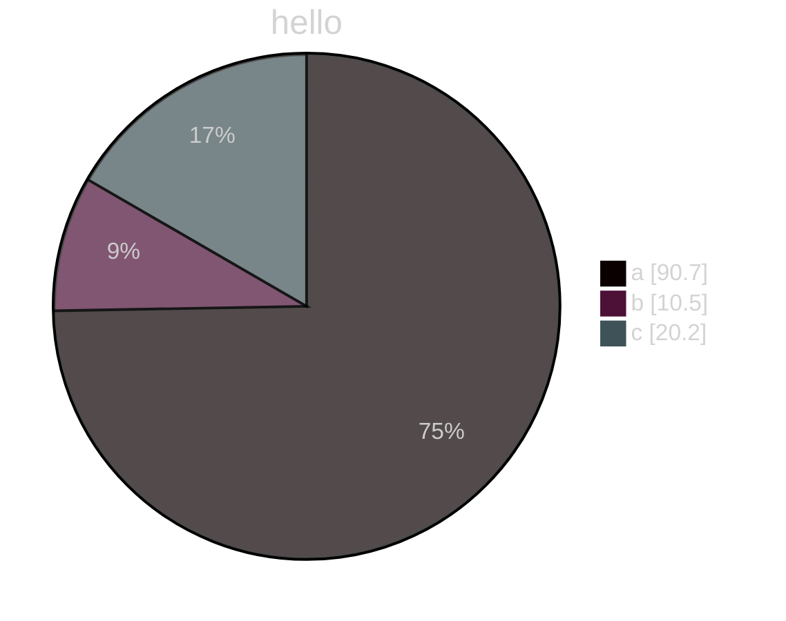
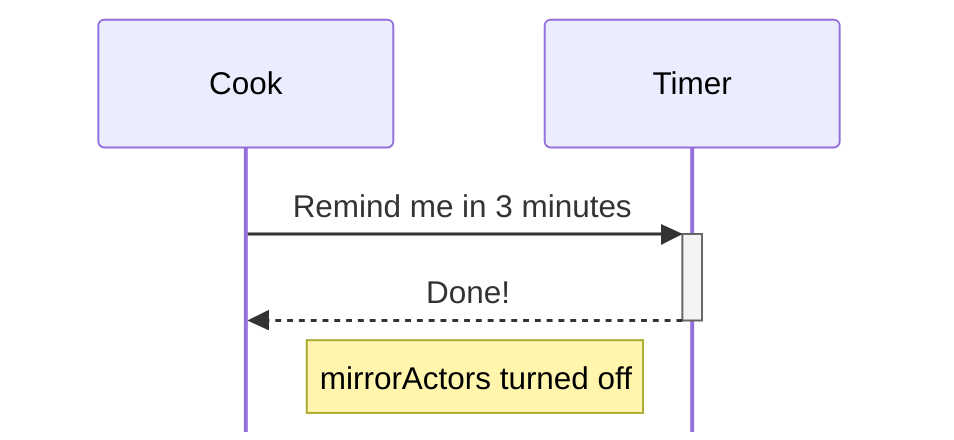

# tips for mermaid

## how to add mermaid into docsify

add following to the index.html

```html
<script src="//unpkg.com/mermaid/dist/mermaid.js"></script>
<script>
  var num = 0;

  mermaid.initialize({ startOnLoad: false });

  window.$docsify = {
    loadSidebar: true,
    markdown: {
      renderer: {
        code: function (code, lang) {
          if (lang === "mermaid") {
            return (
              '<div class="mermaid">' +
              mermaid.render("mermaid-svg-" + num++, code) +
              "</div>"
            );
          }
          return this.origin.code.apply(this, arguments);
        },
      },
    },
  };
</script>
```

## mermaid examples








